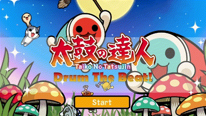
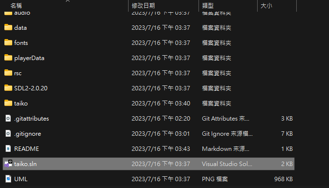
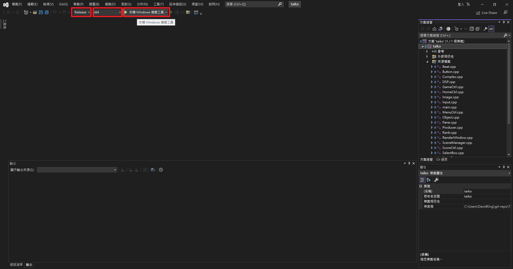

# 太鼓の達人 - 使用 OOP 實作

<p>
  
</p>

## 簡介
使用 Visual studio、C/C++編成撰寫


* 遊戲說明：
	使用滑鼠左鍵點選button選取遊戲項目，
	進入遊戲歌曲選單可以使用滑鼠滾輪上下滑動選擇歌曲，
	點選歌曲名稱的button進入遊戲畫面，
	進入遊戲使用F、J鍵打擊鼓面(紅色)
		使用D、K鍵打擊鼓邊(藍色)

* 製作音符譜：
	在Home頁面點選Compose按鈕


* 遊戲程式說明影片：

	* [程式技巧、架構、遊戲遊玩方式](https://youtu.be/J_XyvO6MhF4)

	* [手動作譜教學及程式技巧講解](https://youtu.be/mcyK223s5-8)

	* [自動作譜及程式技巧講解](https://youtu.be/EKg3Vm7dUDo)


## 如何建置

1. 建置過程會使用 [Visual Studio](https://visualstudio.microsoft.com/downloads/)，請確定已經安裝完成。

2. 從伺服器上取得 repo
```
git clone https://github.com/Xinya25/Taiko_game.git
```

3. 點選 taiko.sln 開啟專案


4. 建置並執行專案
